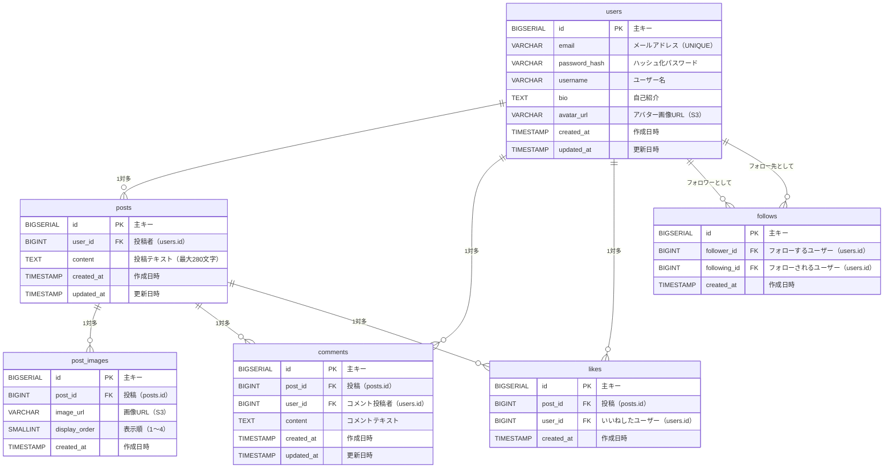

# RaiseTimeLine データモデル・ER図

作成日: 2026-05-12
最終更新日: 2026-05-12

---

## 1. エンティティ概要

| テーブル名 | 概要 |
|-----------|------|
| users | ユーザー情報（認証情報・プロフィール） |
| posts | 投稿（テキスト・作成日時） |
| post_images | 投稿に添付された画像（S3 URL・表示順） |
| comments | 投稿へのコメント |
| likes | 投稿へのいいね（ユーザーと投稿の紐付け） |
| follows | フォロー関係（フォロワーとフォロー先の紐付け） |

---

## 2. ER図

---

## 3. リレーション一覧

| リレーション | 種別 | 説明 |
|------------|------|------|
| users → posts | 1対多 | 1人のユーザーが複数の投稿を持つ |
| users → comments | 1対多 | 1人のユーザーが複数のコメントを持つ |
| users → likes | 1対多 | 1人のユーザーが複数のいいねを持つ |
| users → follows（follower） | 1対多 | 1人のユーザーが複数のユーザーをフォローする |
| users → follows（following） | 1対多 | 1人のユーザーが複数のユーザーにフォローされる |
| posts → post_images | 1対多 | 1つの投稿に最大4枚の画像が紐付く |
| posts → comments | 1対多 | 1つの投稿に複数のコメントが紐付く |
| posts → likes | 1対多 | 1つの投稿に複数のいいねが紐付く |

---

## 4. テーブル定義

### 4.1 users

| カラム名 | 型 | 制約 | 説明 |
|---------|-----|------|------|
| id | BIGSERIAL | PK | 主キー（自動採番） |
| email | VARCHAR(255) | NOT NULL, UNIQUE | メールアドレス |
| password_hash | VARCHAR(255) | NOT NULL | BCryptハッシュ化パスワード |
| username | VARCHAR(50) | NOT NULL | ユーザー名 |
| bio | TEXT | | 自己紹介（最大160文字） |
| avatar_url | VARCHAR(500) | | アバター画像のS3 URL |
| created_at | TIMESTAMP | NOT NULL, DEFAULT NOW() | 作成日時 |
| updated_at | TIMESTAMP | NOT NULL, DEFAULT NOW() | 更新日時 |

---

### 4.2 posts

| カラム名 | 型 | 制約 | 説明 |
|---------|-----|------|------|
| id | BIGSERIAL | PK | 主キー（自動採番） |
| user_id | BIGINT | NOT NULL, FK → users.id | 投稿者 |
| content | TEXT | NOT NULL, CHECK(length ≤ 280) | 投稿テキスト |
| created_at | TIMESTAMP | NOT NULL, DEFAULT NOW() | 作成日時 |
| updated_at | TIMESTAMP | NOT NULL, DEFAULT NOW() | 更新日時 |

---

### 4.3 post_images

| カラム名 | 型 | 制約 | 説明 |
|---------|-----|------|------|
| id | BIGSERIAL | PK | 主キー（自動採番） |
| post_id | BIGINT | NOT NULL, FK → posts.id | 紐付く投稿 |
| image_url | VARCHAR(500) | NOT NULL | 画像のS3 URL |
| display_order | SMALLINT | NOT NULL, CHECK(1〜4) | 表示順 |
| created_at | TIMESTAMP | NOT NULL, DEFAULT NOW() | 作成日時 |

---

### 4.4 comments

| カラム名 | 型 | 制約 | 説明 |
|---------|-----|------|------|
| id | BIGSERIAL | PK | 主キー（自動採番） |
| post_id | BIGINT | NOT NULL, FK → posts.id | コメント先の投稿 |
| user_id | BIGINT | NOT NULL, FK → users.id | コメント投稿者 |
| content | TEXT | NOT NULL | コメントテキスト |
| created_at | TIMESTAMP | NOT NULL, DEFAULT NOW() | 作成日時 |
| updated_at | TIMESTAMP | NOT NULL, DEFAULT NOW() | 更新日時 |

---

### 4.5 likes

| カラム名 | 型 | 制約 | 説明 |
|---------|-----|------|------|
| id | BIGSERIAL | PK | 主キー（自動採番） |
| post_id | BIGINT | NOT NULL, FK → posts.id | いいねした投稿 |
| user_id | BIGINT | NOT NULL, FK → users.id | いいねしたユーザー |
| created_at | TIMESTAMP | NOT NULL, DEFAULT NOW() | 作成日時 |

- **UNIQUE制約**: `(post_id, user_id)` — 同一ユーザーが同一投稿に重複していいねできない

---

### 4.6 follows

| カラム名 | 型 | 制約 | 説明 |
|---------|-----|------|------|
| id | BIGSERIAL | PK | 主キー（自動採番） |
| follower_id | BIGINT | NOT NULL, FK → users.id | フォローするユーザー |
| following_id | BIGINT | NOT NULL, FK → users.id | フォローされるユーザー |
| created_at | TIMESTAMP | NOT NULL, DEFAULT NOW() | 作成日時 |

- **UNIQUE制約**: `(follower_id, following_id)` — 同一ユーザーへの重複フォロー不可
- **CHECK制約**: `follower_id <> following_id` — 自分自身のフォロー不可
