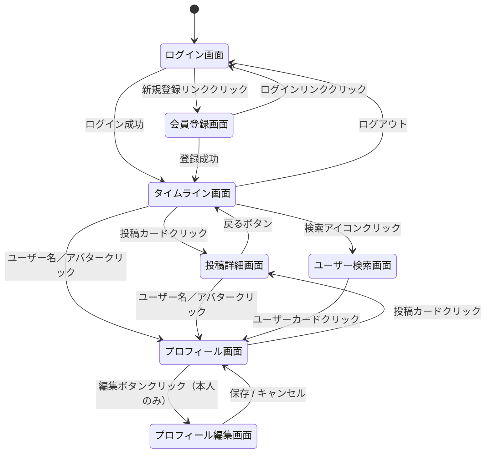

# RaiseTimeLine 画面設計書

作成日: 2026-05-12
最終更新日: 2026-05-12

---

## 1. 画面一覧

| No | 画面名 | URL | 認証要否 | 概要 |
|----|--------|-----|---------|------|
| 1 | ログイン画面 | `/login` | 不要 | メールアドレス・パスワードでログインする |
| 2 | 会員登録画面 | `/register` | 不要 | 新規アカウントを作成する |
| 3 | タイムライン画面 | `/` | 必要 | 全体／フォロー中の投稿をタブ切り替えで表示する |
| 4 | 投稿詳細画面 | `/posts/:id` | 必要 | 投稿の詳細とコメント一覧を表示する |
| 5 | ユーザー検索画面 | `/search` | 必要 | ユーザー名で検索しフォロー操作を行う |
| 6 | プロフィール画面 | `/users/:id` | 必要 | ユーザーのプロフィールと投稿一覧を表示する |
| 7 | プロフィール編集画面 | `/users/:id/edit` | 必要（本人のみ） | アバター・ユーザー名・自己紹介を編集する |

---

## 2. 共通レイアウト

### 2.1 共通ヘッダー（ログイン後全画面）

```
┌─────────────────────────────────────────────────────────┐
│  RaiseTimeLine    [検索アイコン]  [ユーザーアイコン▼]     │
└─────────────────────────────────────────────────────────┘
```

| 要素 | 仕様 |
|------|------|
| ロゴ（RaiseTimeLine） | クリックでタイムライン画面（`/`）へ遷移 |
| 検索アイコン | クリックでユーザー検索画面（`/search`）へ遷移 |
| ユーザーアイコン▼ | クリックでドロップダウンを表示：「プロフィール」「ログアウト」 |

---

## 3. 画面詳細

### 3.1 ログイン画面（`/login`）

```
┌──────────────────────────────────┐
│         RaiseTimeLine            │
│                                  │
│  メールアドレス                   │
│  [________________________]      │
│                                  │
│  パスワード                       │
│  [________________________]      │
│                                  │
│  [      ログイン       ]          │
│                                  │
│  アカウントをお持ちでない方は      │
│  → 新規登録                       │
└──────────────────────────────────┘
```

| 要素 | 仕様 |
|------|------|
| メールアドレス入力 | type="email"、必須 |
| パスワード入力 | type="password"、必須 |
| ログインボタン | APIを呼び出し、成功でタイムライン画面へ遷移 |
| 新規登録リンク | `/register` へ遷移 |
| エラー表示 | 認証失敗時にフォーム上部に「メールアドレスまたはパスワードが正しくありません」を表示 |

---

### 3.2 会員登録画面（`/register`）

```
┌──────────────────────────────────┐
│         RaiseTimeLine            │
│         新規アカウント登録         │
│                                  │
│  ユーザー名                       │
│  [________________________]      │
│                                  │
│  メールアドレス                   │
│  [________________________]      │
│                                  │
│  パスワード                       │
│  [________________________]      │
│                                  │
│  パスワード（確認）                │
│  [________________________]      │
│                                  │
│  [      登録する       ]          │
│                                  │
│  すでにアカウントをお持ちの方は    │
│  → ログイン                       │
└──────────────────────────────────┘
```

| 要素 | 仕様 |
|------|------|
| ユーザー名入力 | 必須、最大50文字 |
| メールアドレス入力 | type="email"、必須、重複チェックあり |
| パスワード入力 | type="password"、必須、最小8文字 |
| パスワード確認入力 | type="password"、必須、パスワードと一致チェック |
| 登録するボタン | APIを呼び出し、成功でタイムライン画面へ遷移 |
| ログインリンク | `/login` へ遷移 |

---

### 3.3 タイムライン画面（`/`）

```
┌─────────────────────────────────────────────────────────┐
│  RaiseTimeLine    [検索]  [ユーザー▼]                    │
├─────────────────────────────────────────────────────────┤
│                                                         │
│  [アバター]  投稿フォーム                                │
│             [テキストを入力... (最大280文字)]            │
│             [📷 画像を追加]    残り XXX文字  [投稿する]  │
│                                                         │
├─────────────────────────────────────────────────────────┤
│  [おすすめ] [フォロー中]                                 │
├─────────────────────────────────────────────────────────┤
│                                                         │
│  ┌─────────────────────────────────────────────────┐   │
│  │ [アバター] ユーザー名          投稿日時  [...]  │   │
│  │           投稿テキスト                          │   │
│  │           [画像サムネイル（最大4枚）]            │   │
│  │           ♡ いいね数    💬 コメント数           │   │
│  └─────────────────────────────────────────────────┘   │
│                                                         │
│  （投稿カードが繰り返し表示される）                      │
│                                                         │
└─────────────────────────────────────────────────────────┘
```

| 要素 | 仕様 |
|------|------|
| 投稿フォーム | テキストエリア（最大280文字）と画像選択ボタン（最大4枚） |
| 文字数カウンター | リアルタイムで残り文字数を表示、280文字超過で赤色表示 |
| タブ（おすすめ） | 全ユーザーの投稿を新着順に表示 |
| タブ（フォロー中） | フォロー中ユーザーの投稿のみを新着順に表示 |
| 投稿カード | アバター・ユーザー名・投稿日時・テキスト・画像・いいね数・コメント数を表示 |
| アバター／ユーザー名 | クリックでプロフィール画面へ遷移 |
| 投稿カード本体 | クリックで投稿詳細画面へ遷移 |
| いいねボタン（♡） | クリックでいいね／取り消しを切り替え |
| コメントアイコン（💬） | クリックで投稿詳細画面へ遷移 |
| 「…」メニュー | 自分の投稿の場合のみ表示：「編集」「削除」 |

---

### 3.4 投稿詳細画面（`/posts/:id`）

```
┌─────────────────────────────────────────────────────────┐
│  RaiseTimeLine    [検索]  [ユーザー▼]                    │
├─────────────────────────────────────────────────────────┤
│  ← 戻る                                                 │
│                                                         │
│  ┌─────────────────────────────────────────────────┐   │
│  │ [アバター] ユーザー名          投稿日時  [...]  │   │
│  │           投稿テキスト                          │   │
│  │           [画像（最大4枚グリッド表示）]          │   │
│  │           ♡ いいね数    💬 コメント数           │   │
│  └─────────────────────────────────────────────────┘   │
│                                                         │
│  コメント (XX件)                                        │
│  ─────────────────────────────────────────────────     │
│                                                         │
│  [アバター]  コメント投稿フォーム                        │
│             [コメントを入力...]  [コメントする]          │
│                                                         │
│  ─────────────────────────────────────────────────     │
│  [アバター] ユーザー名    コメント日時  [...]            │
│            コメントテキスト                              │
│                                                         │
│  （コメントが繰り返し表示される）                        │
└─────────────────────────────────────────────────────────┘
```

| 要素 | 仕様 |
|------|------|
| 戻るボタン | ブラウザの履歴を1つ戻る |
| 投稿カード | タイムラインと同様の表示（いいね・コメント数も含む） |
| 画像表示 | 最大4枚をグリッドレイアウトで表示、クリックで拡大 |
| コメント投稿フォーム | テキストエリア＋「コメントする」ボタン |
| コメント一覧 | 新着順で表示 |
| コメントの「…」メニュー | 自分のコメントのみ表示：「編集」「削除」 |

---

### 3.5 ユーザー検索画面（`/search`）

```
┌─────────────────────────────────────────────────────────┐
│  RaiseTimeLine    [検索]  [ユーザー▼]                    │
├─────────────────────────────────────────────────────────┤
│                                                         │
│  ユーザーを検索                                          │
│  [🔍 ユーザー名を入力...]                                │
│                                                         │
│  ─────────────────────────────────────────────────     │
│                                                         │
│  ┌─────────────────────────────────────────────┐       │
│  │ [アバター]  ユーザー名        [フォローする] │       │
│  └─────────────────────────────────────────────┘       │
│                                                         │
│  ┌─────────────────────────────────────────────┐       │
│  │ [アバター]  ユーザー名        [フォロー解除] │       │
│  └─────────────────────────────────────────────┘       │
│                                                         │
└─────────────────────────────────────────────────────────┘
```

| 要素 | 仕様 |
|------|------|
| 検索フォーム | ユーザー名を入力（部分一致）、入力のたびに検索結果を更新 |
| ユーザーカード | アバター・ユーザー名・フォローボタンを表示 |
| フォローボタン | 未フォロー：「フォローする」、フォロー中：「フォロー解除」 |
| ユーザーカードのクリック | プロフィール画面へ遷移 |
| 検索結果0件 | 「ユーザーが見つかりませんでした」を表示 |
| 自分自身 | フォローボタンを非表示にする |

---

### 3.6 プロフィール画面（`/users/:id`）

```
┌─────────────────────────────────────────────────────────┐
│  RaiseTimeLine    [検索]  [ユーザー▼]                    │
├─────────────────────────────────────────────────────────┤
│                                                         │
│  ┌──────────────────────────────────────────────────┐  │
│  │  [アバター画像（大）]                            │  │
│  │                                                  │  │
│  │  ユーザー名                  [フォローする] ※他人  │  │
│  │  @username                  [プロフィール編集] ※本人 │  │
│  │                                                  │  │
│  │  自己紹介テキスト                                │  │
│  │                                                  │  │
│  │  フォロー中 XX人   フォロワー XX人               │  │
│  └──────────────────────────────────────────────────┘  │
│                                                         │
│  投稿 (XX件)                                            │
│  ─────────────────────────────────────────────────     │
│                                                         │
│  （投稿カードが繰り返し表示される）                      │
│                                                         │
└─────────────────────────────────────────────────────────┘
```

| 要素 | 仕様 |
|------|------|
| アバター画像 | S3のURLを参照して表示、未設定の場合はデフォルト画像 |
| ユーザー名 | 登録時に設定したユーザー名 |
| フォローするボタン | 他ユーザーのプロフィールのみ表示 |
| プロフィール編集ボタン | 自分のプロフィールのみ表示、クリックで編集画面へ遷移 |
| フォロー中／フォロワー数 | クリックでフォロー一覧・フォロワー一覧モーダルを表示 |
| 投稿一覧 | そのユーザーの投稿を新着順で表示（タイムラインと同様のカード） |

---

### 3.7 プロフィール編集画面（`/users/:id/edit`）

```
┌─────────────────────────────────────────────────────────┐
│  RaiseTimeLine    [検索]  [ユーザー▼]                    │
├─────────────────────────────────────────────────────────┤
│                                                         │
│  プロフィール編集                                        │
│  ─────────────────────────────────────────────────     │
│                                                         │
│  アバター画像                                            │
│  [アバター画像（現在）]  [画像を変更する]                │
│                                                         │
│  ユーザー名 *                                            │
│  [________________________________]                     │
│                                                         │
│  自己紹介                                               │
│  [________________________________]                     │
│  [________________________________]                     │
│                                                         │
│  [キャンセル]    [保存する]                              │
│                                                         │
└─────────────────────────────────────────────────────────┘
```

| 要素 | 仕様 |
|------|------|
| アバター画像 | 現在の画像を表示、「画像を変更する」で画像選択ダイアログを開く |
| ユーザー名 | 必須、最大50文字 |
| 自己紹介 | 任意、最大160文字 |
| キャンセルボタン | プロフィール画面に戻る（変更を破棄） |
| 保存するボタン | APIを呼び出しプロフィールを更新、成功でプロフィール画面へ遷移 |

---

## 4. エラーハンドリング

### 4.1 投稿フォーム

| エラーケース | 対応 |
|-------------|------|
| テキストが空かつ画像なし | 「テキストまたは画像を入力してください」を表示 |
| テキストが281文字以上 | 「280文字以内で入力してください」を表示（文字数カウンター赤色） |
| 画像が5枚以上 | 「画像は最大4枚まで添付できます」を表示 |
| 画像アップロード失敗 | 「画像のアップロードに失敗しました」を表示 |

### 4.2 認証

| エラーケース | 対応 |
|-------------|------|
| ログイン失敗 | 「メールアドレスまたはパスワードが正しくありません」 |
| メールアドレス重複 | 「このメールアドレスはすでに使用されています」 |
| パスワード不一致 | 「パスワードが一致しません」 |

### 4.3 共通

| エラーケース | 対応 |
|-------------|------|
| 未認証でのアクセス | ログイン画面（`/login`）へリダイレクト |
| 存在しないリソース | 「ページが見つかりません（404）」を表示 |
| サーバーエラー | 「エラーが発生しました。しばらく時間をおいて再試行してください」を表示 |

---

## 5. 画面遷移図


